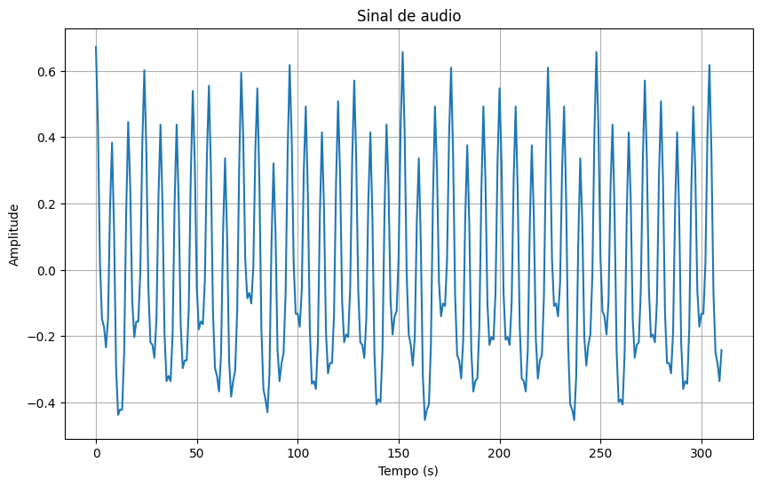
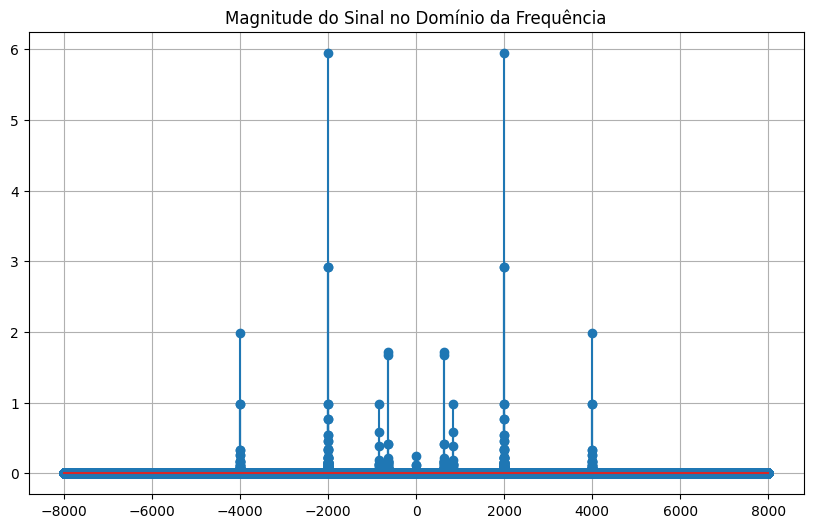
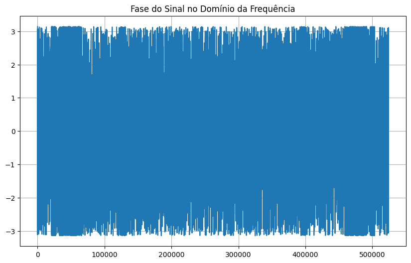

# Componente de um Sinal - Relatório

Federal University of Campina Grande
Hortência Diniz Dultra e Silva - 02/11/23
Separação de Componentes de um Sinal - PDS Class - Atividade 3

No arquivo sinal.wav foi gravado um sinal composto de soma de cossenos amostrados a Fs = 16kHz. 
Deseja-se saber quantas componentes (cossenos) formam esse sinal. Considerando que a componente de menor frequências (que não seja o nível DC caso ele esteja presente) é o nível de referência, qual a potência relativa dos demais? Além disso, também foi solicitado um sistema que separe as componentes do sinal gravado.

Sua tarefa é atender as solicitações acima entregando um relatório mostrando:
1. Quais frequências estão presentes?
4. Qual a relação de potência entre elas;
5. Qual o valor em volts das componentes se a menor frequência tem 1V;

# Build e Execução

