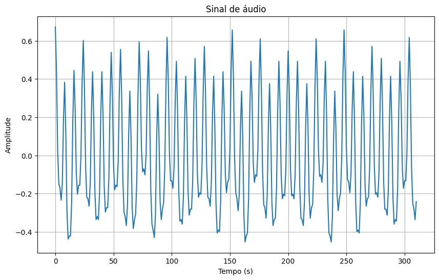

# Componente de um Sinal - Report

* Federal University of Campina Grande

* Hortência Diniz Dultra e Silva - 02/11/23

* Separação de Componentes de um Sinal - PDS Class - Atividade 3

  No arquivo sinal.wav foi gravado um sinal composto de soma de cossenos amostrados a Fs = 16KHz. 
Deseja-se saber quantas componentes (cossenos) formam esse sinal. Considerando que a componente de menor frequências (que não seja o nível DC caso ele esteja presente) é o nível de referência, qual a potência relativa dos demais? Além disso, também foi solicitado um sistema que separe as componentes do sinal gravado.

  Sua tarefa é atender as solicitações acima entregando um relatório mostrando:
1. Quais frequências estão presentes?
2. Qual a relação de potência entre elas;
3. Qual o valor em volts das componentes se a menor frequência tem 1V;

# Build e Execução

  O cógido para esta questão foi feito em Python e utilizou-se o Colab para execução.

  A seguir, listarei alguns comentários importantes sobre a construção do código:

* A biblioteca usada para importar o áudio foi a wavefile; 

* O código utilizado foi o mesmo implementado anteriormente para a FFT;

* A importação do áudio foi por meio do drive, com o ```google.colab```;

* A seguir, o áudio foi convertido em um array de valores float;

* A função FFT foi chamada e como parâmentro, o áudio foi enviado;

* A taxa de amostagrem do áudio é de 16KHz e no domínio da frequência, o gráfico foi plotado. Nele, percebem-se quatro frequências com amplitudes diferentes, são estas: 630Hz/-24dB, 818Hz/-84dB, 2KHz/-21dB, 4KHz/-19dB. O site usado para rodar o áudio e ver as amplitudes em dB foi https://www.checkhearing.org/audioPlotSpectrum.php





